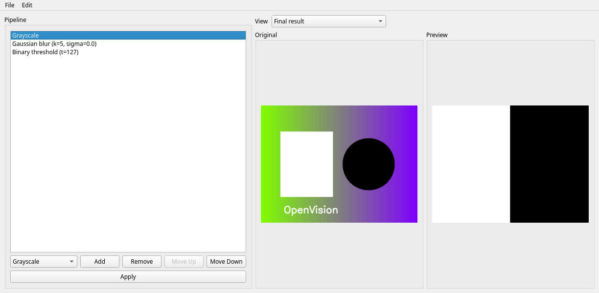

# OpenVision Lab

A desktop playground for learning and experimenting with Computer Vision. Load
an image and build an editable pipeline of processing steps.



## Features

- Editable pipeline: add, remove, and reorder processing steps.
- Five processors: grayscale, Gaussian blur, binary threshold, adaptive
  threshold, and Canny edge detection.
- Per-step parameters (blur kernel size and sigma, threshold value, adaptive
  block size, constant and method, and Canny hysteresis thresholds and
  aperture).
- Preview of the final result or any intermediate stage.
- Export the final result as PNG, JPEG, BMP, or TIFF.
- Undo and redo for pipeline changes.
- Save and load pipelines as readable JSON.
- Deterministic processing tests plus UI tests with `pytest-qt`.

## Quick start

Requirements: Python 3.14 and [uv](https://docs.astral.sh/uv/).

```bash
uv sync
uv run python -m openvision_lab
```

## Usage

1. Open an image with `File > Open Image...` (PNG, JPEG, BMP, or TIFF).
2. Build the pipeline in the left panel: pick a processor and click `Add`,
   select a step to edit its parameters, and use `Remove`, `Move Up`, or
   `Move Down` to change it.
3. Click `Apply` to reprocess with the current steps.
4. Use the `View` selector to preview the final result or any intermediate
   stage.
5. Use `File > Save Result As...` to export, `Edit > Undo`/`Redo` for changes,
   and `File > Save Pipeline...`/`Load Pipeline...` for persistence.

## Architecture

Processing, pipeline state, persistence, and history are kept separate from the
Qt interface. See [`docs/architecture.md`](docs/architecture.md) for the module
map and key decisions.

## Development

```bash
uv run pytest
uv run ruff format --check .
uv run ruff check .
uv run mypy
uv run python scripts/generate_screenshot.py   # regenerate the screenshot
```

## Project status

The feature roadmap and current milestone are documented in
[`ROADMAP.md`](ROADMAP.md).

## License

MIT. See [`LICENSE`](LICENSE).
